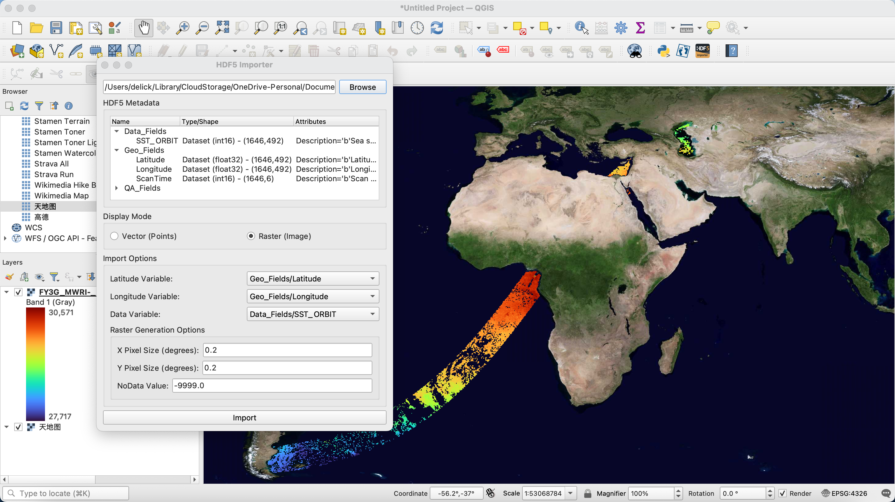
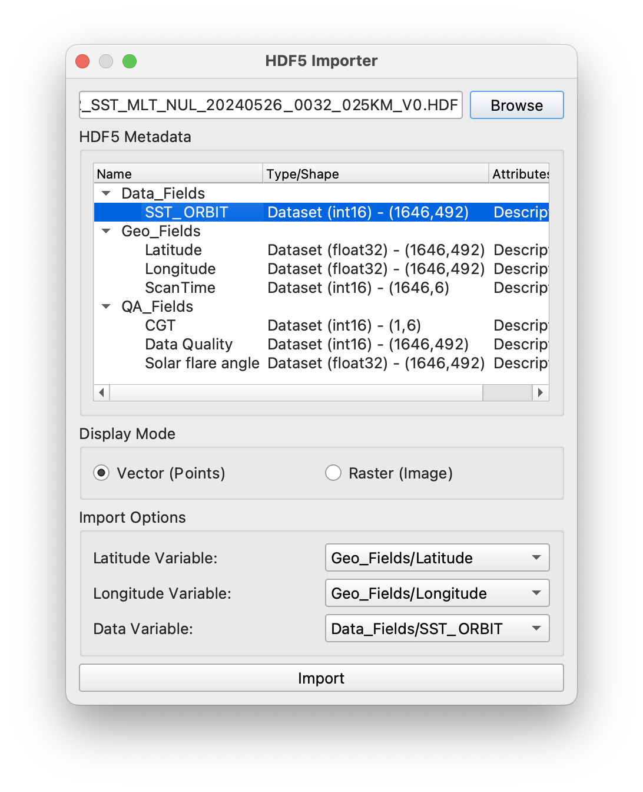
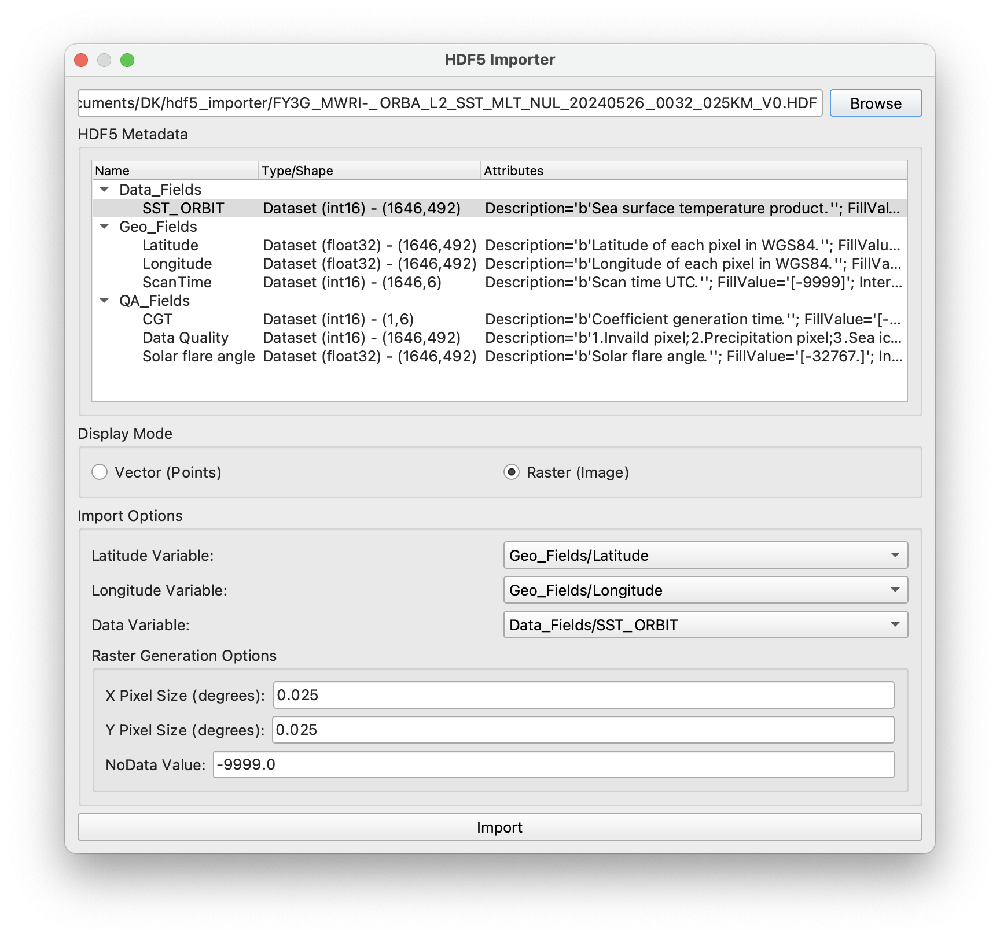

# QGIS HDF5 Importer Plugin 

This plugin imports satellite observations in HDF5 file as vector points or raster image.
It allows users to select an HDF5 file, view its metadata, choose latitude and longitude variables, and load the data as a point vector or a raster image layer in QGIS.

## Requirements for installing this plugin

- **QGIS 3.4+** : A valid QGIS installation with version number 3.4 and above,
- **Python libraries**:
    - `h5py`: for reading HDF5 dataset, and
    - `gdal`: for converting to raster images.

## Usage

1. Install the plugin via zip. [Load plugins from zip - QGIS Documentation](https://docs.qgis.org/3.40/en/docs/user_manual/plugins/plugins.html#the-install-from-zip-tab)
2. You can find the plugin either from
    - `Plugins` - `HDF5 importer` - `Import HDF5 file`, or
    - An icon  in QGIS Toolbar.
3. Open the plugin window, select the HDF5 file you want to load via file selection window.
4. Choose the correct display mode: vector or raster[^1].
5. After loading the HDF5 file, you will see the metadata associated to each varaiable, choose the correct lat/lon variable name for the dataset you want to import.
6. Click import, and you will see the data is now imported to the QGIS layer.

[^1]: Note: import as raster may take some time depending on your dataset size, spatial extent and the resolution, etc.

## Options

- **Select HDF5 file**: This option can let user browse files in native file browser and filter the HDF5 file format (`*.h5`, `*.hdf5`, `*.HDF5`). User can also disable the file filter by choosing all files (`*.*`) in drop down menu.
- **HDF5 Metadata**: This section can display the metadata for each variable inside the HDF5 file. User can expand HDF5 group and see varialbe inside the group by clicking the arrow before group name.
- **Display Mode**: This section let the user choose the display mode of the HDF5 data. Currently supported: Vector (Points) and Raster (Image).
    - **Vector mode**: This mode each obseration is a point feature.

- **Import Options**: Options for import, including:

    - **Latitude Variable**: Select which variable to treat as latitude. Note this variable should be the same size as your Data variable.
    - **Longitude Variable**: Select which variable to treat as longitude. Note this variable should be the same size as your Data variable.
    - **Data Variable**: Select which variable to treat as data value. The data values will be stored as attributes.

For raster import, this plugin first import the data as vector, and then converts the vector to raster image using gdal translate. Users should set the following options:

- **X pixel size (degree)**: Set the pixel size in X direction.[^2]
- **Y pixel size (degree)**: Set the pixel size in Y direction.
- **Nodata value**: The plugin will treat this value as nodata.

[^2]: This may affect the resolution of the raster image. To avoid performance issues, do not set the pixel size too small.